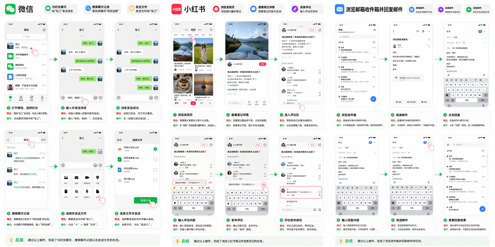

## Language

[中文 README](./README.md)

# SitoAgent (Open Source)

SitoAgent is a mobile GUI agent that runs on real Android devices (Kivy + python-for-android). It uses ADB to capture screenshots/XML and executes actions such as tap and swipe.



Open-source features:

- Supports sending tasks to the phone via script (ADB Intent / optional file inbox mode)
- Includes a reusable skill description that can be invoked by other agents

NOTICE BEFORE USE
This project is intended solely for research and educational purposes. Any use for illegal information acquisition, system interference, or any unlawful activities is strictly prohibited. If developers/users fail to comply with applicable laws, regulations, policies, industry standards (including but not limited to technical specifications and security standards), and the terms of this open-source project, all legal liabilities, economic losses, and adverse consequences arising therefrom shall be borne solely and independently by the developers/users.

## Repository Layout

- [main.py](./main.py): Android app (UI + task entry)
- [scripts/](./scripts): ADB control, model calls, task executor
- [config.yaml](./config.yaml): Model/runtime configuration (do not commit real keys)
- [安装部署说明.md](./安装部署说明.md): Build/install/export guide (Chinese)

## Quick Start

### 1) Prerequisites

- Windows (PowerShell 7 recommended)
- WSL (Ubuntu) + buildozer + python-for-android
- ADB on PC: `adb devices` shows at least one `device` (download: https://developer.android.com/studio/releases/platform-tools)
- Enable Developer options and USB debugging on the Android device
- If you need to input text during automation, install an ADB keyboard on the phone (e.g. https://github.com/senzhk/ADBKeyBoard)

Developer options & USB debugging:

- Enable Developer options: typically go to Settings → About phone → Version number, then tap it rapidly about 10 times until you see “Developer mode enabled”. Menu names may vary by device; search online if you cannot find it.
- Enable USB debugging: after Developer options are enabled, go to Settings → Developer options → USB debugging and turn it on.
- On some devices, you may need to reboot after enabling Developer options. You can verify the connection by plugging the phone into your PC and running `adb devices`. If no device shows up, the connection failed.
- Make sure all required permission prompts are granted

Install ADB Keyboard (Android only, for text input):

- Download and install the APK on the Android device
- After installation, enable ADB Keyboard in Settings → Input method / Keyboard list (or run: `adb shell ime enable com.android.adbkeyboard/.AdbIME`)

### 2) Local Configuration

Edit [config.yaml](./config.yaml):

- `OPENAI_API_KEY` / `DASHSCOPE_API_KEY` / `ARK_API_KEY`: set locally or via environment variables; never commit real keys
- `ANDROID_SCREENSHOT_DIR` / `ANDROID_XML_DIR`: intermediate artifact directories on the device

### 3) Build & Install

Recommended:

```powershell
.\one_click_build_install.ps1
```

Fast iteration:

```powershell
.\quick_build.ps1 -Install
```

### 4) Run a Task

- Launch the app on the phone (package name: `org.test.orderquery`)
- Paste a task into the bottom input box and send (or use the sidebar Run Task)
- Task artifacts are stored under the app private directory (typical path): `/data/user/0/org.test.orderquery/files/app/tasks/`

### 5) Send Tasks via Script (Recommended)

Send a task via Intent:

```powershell
.\send_task.ps1 -Task "Open Xiaohongshu, open the first post on the home feed, scroll down 2-3 screens, then go back to home and finish."
```

File inbox mode (optional):

```powershell
.\send_task.ps1 -UseFileInbox -LaunchApp -Task "..."
```

## License

This project is a derivative work based on [AppAgent](https://github.com/TencentQQGYLab/AppAgent) (MIT licensed, originally created by Jiaxuan Liu).

MIT License: see [LICENSE](./LICENSE).
